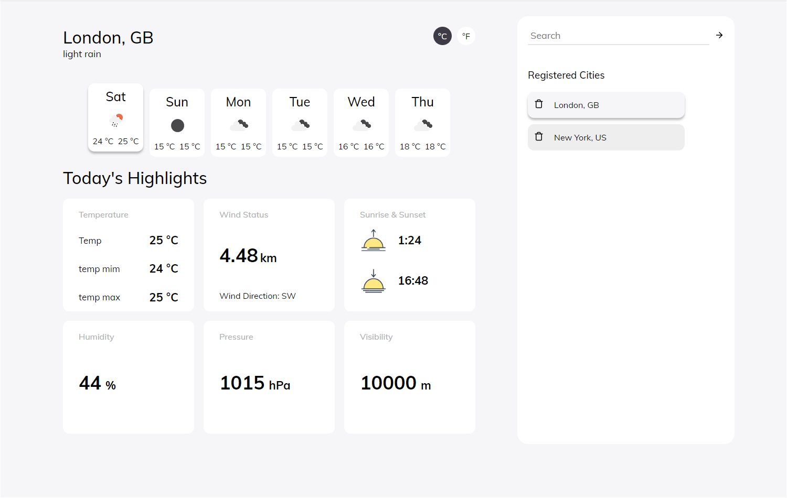

<h1 align="center">
    oWeather
</h1>

## oWeather
Projeto de clima


<p align="center">
  <a href="#tecnologias">Tecnologias</a>&nbsp;&nbsp;&nbsp;|&nbsp;&nbsp;&nbsp;
  <a href="#projeto">Projeto</a>&nbsp;&nbsp;&nbsp;|&nbsp;&nbsp;&nbsp;
  <a href="#começando">Começando</a>&nbsp;&nbsp;&nbsp;|&nbsp;&nbsp;&nbsp;
  <a href="#telas-do-projeto">Telas do projeto</a>&nbsp;&nbsp;&nbsp;|&nbsp;&nbsp;&nbsp;
  <a href="#licença">Licença</a>
</p>


## Tecnologias

Esse projeto foi desenvolvido com algumas tecnologias, entre quais são:


- [axios](https://github.com/axios/axios)
- [react](https://reactjs.org/)
- [styled components](https://styled-components.com/)
- [date-fns](https://date-fns.org/)


## Projeto

oWeather é um site de clima inspirado nas ideias de projetos do site [App Ideas Collection](https://github.com/florinpop17/app-ideas) no github. Onde tem uma listagem de ideias do básico ao avançado.


## Começando

- Antes de começar crie uma conta no [openweather](https://openweathermap.org/) para ter o appid e coloque no arquivo .env, que terá um como exemplo.

 1. Clone esse repositorio ```git clone https://github.com/olucasokarin/oweather.git```
 2. Mova para a directorio: ```cd oweather```
 3. Run ```yarn``` para instalar as dependências
 4. Run ```yarn start```


## Telas do projeto

### Tela principal



 ## Licença

Esse projeto está sob a licença MIT. Veja o arquivo [LICENSE](LICENSE) para mais detalhes.

